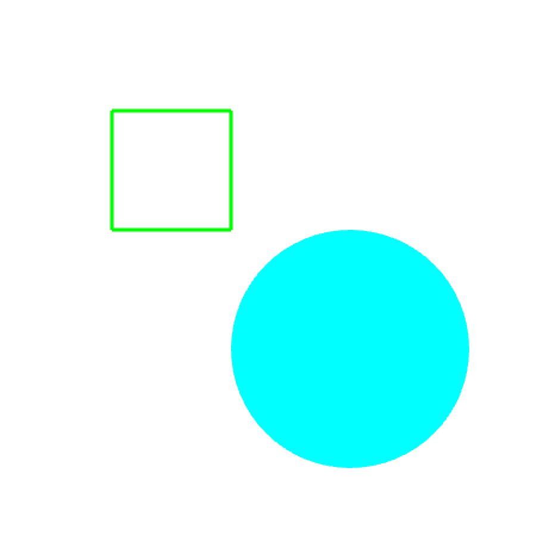

# 03 カラー


## 背景色　

### 背景色（単色）ofBackground
 * グレースケール `ofBackground(0);`
 * RGB `ofBackground(0, 0, 0);`

&nbsp;

### 背景色（HEX） ofBackgroundHex
 
 * 16進数指定 `ofBackgroundHex(0xff0000);`


&nbsp;

### 背景色（グラデーション） ofBackgroundGradient
draw内に記述する

```
void ofApp::draw(){ 
    ofColor colorOne;
    ofColor colorTwo; 
    colorOne.set (255, 0, 0);
    colorTwo.set (0, 0, 255);

    ofBackgroundGradient(colorOne, colorTwo, OF_GRADIENT_CIRCULAR);  
}    
```

* 円形グラデーション `OF_GRADIENT_CIRCULAR`
* 線形グラデーション `OF_GRADIENT_LINEAR`
* BARグラデーション OF_GRADIENT_BAR

[ofBackgroundGradient](http://openframeworks.jp/documentation/graphics/ofGraphics.html#!show_ofBackgroundGradient) 


&nbsp;
&nbsp;

## 描画色

### 色の設定　ofSetColor
初期値はRGB

* RGB `ofSetColor(0, 255, 0);`

*  HEXの指定 `ofSetHexColor(0xb5de10);`

0x の後に16進数のカラーコードを記述する

&nbsp;

##### 色の塗りつぶし
`ofFill();`

&nbsp;

##### 色を塗りつぶさない
`ofNoFill();`


```
void ofApp::draw(){
	// 四角形
	ofSetColor(0, 255, 0);
	ofNoFill();
	ofSetLineWidth(4);
	ofDrawRectangle(100, 100, 100, 100);
	    
	// 丸
	ofSetColor(0, 255, 255);
	ofFill();
	ofDrawCircle(300, 300, 100);
}

```



&nbsp;
&nbsp;

## HSB　色相彩度明度

色相、彩度、明度で表現するとトーンが固定されるので配色設計しやすい


##### HSB関数

```
ofColor c;
c.setHsb(ofRandom(255),255,255);

```
0~255で指定する


&nbsp;


##### HSBA(alpha)の関数を自作
```
void ofApp::setHSBA(int hue, int saturation, int brightness, int alpha){
    int setHue = (int)ofMap(hue, 0 , 360, 0, 255);
    int setSaturation = (int)ofMap(saturation, 0 , 100, 0, 255);
    int setBrightness = (int)ofMap(brightness, 0 , 100, 0, 255);
    int setAlpha = (int)ofMap(alpha, 0, 100, 0, 255);
    ofColor c;
    c.setHsb(setHue, setSaturation, setBrightness, setAlpha);
    return ofSetColor(c);
}
```

&nbsp;
&nbsp;

## カラー型変数
`ofColor red;`


```
ofColor red(255,0,0);
ofSetColor(red);

```


```
ofSetColor( ofColor(0, 0, ofRandom( 128, 255 ) );
```


```
float hue = ofMap(ofRandom(0,360),0,360,0,255);
float saturation = ofMap(ofGetMouseX(), 0, ofGetWidth(), 0, 255);
float brightness = ofMap(ofGetMouseY(), 0, ofGetHeight(), 0, 255);

ofColor col;
col.setHsb(hue,saturation,brightness);
ofSetColor(col);

```

&nbsp;

###　カラー型配列

```
ofColor *colors = new ofColor[3];
colors[0].r = 255;
colors[0].g = 0;
colors[0].b = 0;
colors[1].r = 0;
colors[1].g = 255;
colors[1].b = 0;
colors[2].r = 0;
colors[3].g = 0;
colors[3].b = 255;
 
for (int i=0; i< 3; i++) {
    ofSetColor(colors[i].r, colors[i].g, colors[i].b);
    ofDrawCircle(100*i, 100*1, 20);
}
```

もしくは

```
ofColor *col = new ofColor[3];
col[0].setHex(0xFFFFFF);
col[1].setHex(0x00FF00);
col[2].setHex(0x0000FF);
    
for (int i=0; i< 3; i++) {
    ofSetColor(col[i]);
    ofDrawCircle(100*i, 100*1, 20);
}

```


&nbsp;
&nbsp;

## 混色

`ofEnableBlendMode(OF_BLENDMODE_ALPHA);`

* アルファ `OF_BLENDMODE_ALPHA`
* 加算 `OF_BLENDMODE_ADD`
* 乗算 `OF_BLENDMODE_MULTIPLY`
* 減算 `OF_BLENDMODE_SUBTRACT`
* スクリーン `OF_BLENDMODE_SCREEN`