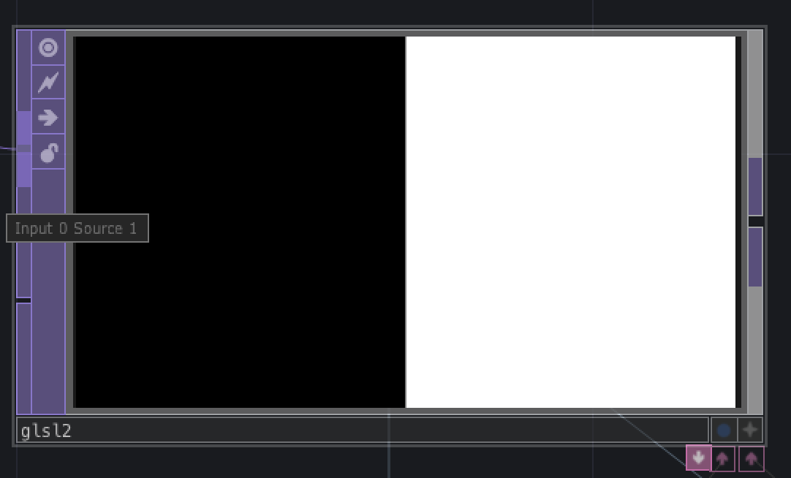

# GLSL

## GLSLとは

GPUを利用する高レベルシェーディング言語。高速に([Wikipedia](https://ja.wikipedia.org/wiki/OpenSound_Control))


&nbsp;
&nbsp;

## GLSLの設定


&nbsp;
&nbsp;


## GLSLの関数

### step関数
条件分岐を行う

```
step(float edge, Tf x)
```
xの値が境界値(edge)より小さい場合は0、大きい場合は1を返す

&nbsp;

if文の場合は

```
out vec4 fragColor;
void main()
{
  vec2 pos = vUV.st;
  vec4 color = vec4(0.0);
  //x座標が0.5以下なら
  if (pos.x < 0.5) {
    color = texture(sTD2DInputs[0], pos);
  } else {
    color = texture(sTD2DInputs[0], pos).bgra;
  }
  fragColor = TDOutputSwizzle(color);
}

```

stepを使うと

```
out vec4 fragColor;
void main()
{
  vec2 pos = vUV.st;
  vec3 color = vec3(0.0);
  
  float edge = 0.5;
  float result = step(edge, pos.x);
 
  fragColor = TDOutputSwizzle(vec4(vec3(result), 1.0));
}

```



&nbsp;
&nbsp;


### mix関数

線形補間

```
mix(Tf x, Tf y, Tfd a);
```
xからyの値をaによって変化（lliner Blend）させる
&nbsp;